<div align="center">

# 🏠 Homeserver

**Your passwords, files and photos — on a machine you own, in a room you're standing in.**

A self-hosted stack for a home network: a password manager, cloud storage, a network
ad-blocker and a few web tools, all behind HTTPS. One Go binary — **`hsctl`** — sets it up,
runs it, backs it up, and serves a web dashboard, so the people you share it with never have
to touch a terminal.

[](LICENSE)
[](https://github.com/Rishikesh01/homeserver/actions/workflows/ci.yml)
[](https://github.com/Rishikesh01/homeserver/tags)
[](hsctl/go.mod)

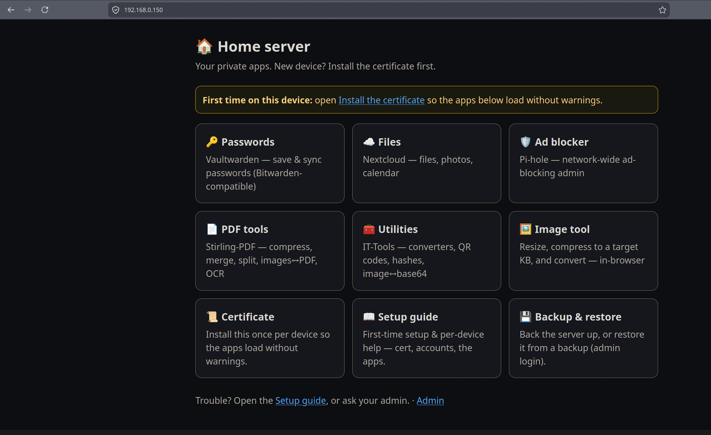

</div>

---

## Why

Most self-hosting guides leave you with a pile of `docker-compose.yml` files and no answer for
the parts that actually matter: how does a family member get on it, is HTTPS real, and *does
the backup actually restore?*

This project answers those three:

- **Everything is HTTPS, on your LAN, with no public domain.** Caddy runs a private CA and
  issues real certificates for the server's IP. Install the root cert once per device and the
  browser padlock is genuine — which is what makes the Bitwarden and Nextcloud mobile apps
  agree to connect at all.
- **Non-technical users get a dashboard, not a shell.** Tiles for each app, a rendered
  setup guide they can follow themselves, and an admin area with system health, drives,
  backups, a command center and a real terminal.
- **The backups are tested, not hoped for.** `hsctl backup verify` runs a five-check drill —
  including booting a real Vaultwarden image and proving a byte-identical SQLite round-trip,
  plus a WAL-loss regression test — against throwaway volumes, never your live data.

---

## What you get

| Tile | What it is | Folder | URL |
|------|-----------|--------|-----|
| 🏠 **Dashboard** | Home page — links to everything | `hsctl/` | **https://HOST** |
| 🔑 Vaultwarden | Password manager (works with the Bitwarden apps) | `vaultwarden/` | https://HOST:8443 |
| ☁️ Nextcloud | Cloud file storage / photos / calendar | `nextcloud/` | https://HOST:8444 |
| 🛡️ Pi-hole | Network ad-blocker (admin) | `pihole/` | https://HOST:8445/admin |
| 📄 Stirling-PDF | Compress / merge / split / convert PDFs | `stirling/` | https://HOST:8446 |
| 🧰 IT-Tools | Converters, QR codes, hashes, image↔base64 | `it-tools/` | https://HOST:8447 |
| 🖼️ Image tool | Resize / compress-to-KB / convert (in your browser) | `imagetools/` | https://HOST:8448 |
| Caddy | The HTTPS front door — one cert per app | `caddy/` | — |

`HOST` = your server's LAN IP. The dashboard is built from
[`services.json`](services.json), so adding or removing an app updates it automatically.

<details>
<summary><b>📸 More screenshots</b> — install, setup wizard, logins, admin, apps, updates, commands, backups, drives, terminal</summary>

<br>

| | |
|---|---|
| **Install** — `hsctl install` starts the HTTPS dashboard and prints the first-login details | **Settings** — review the automatically detected server configuration |
| 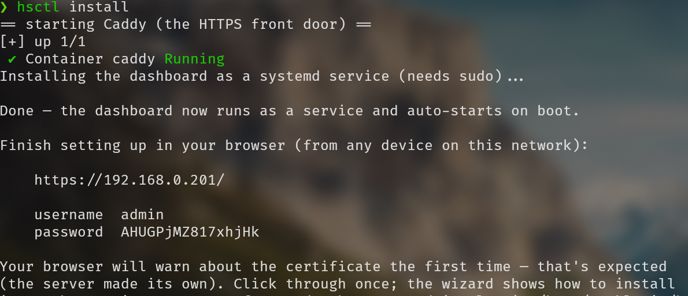 | 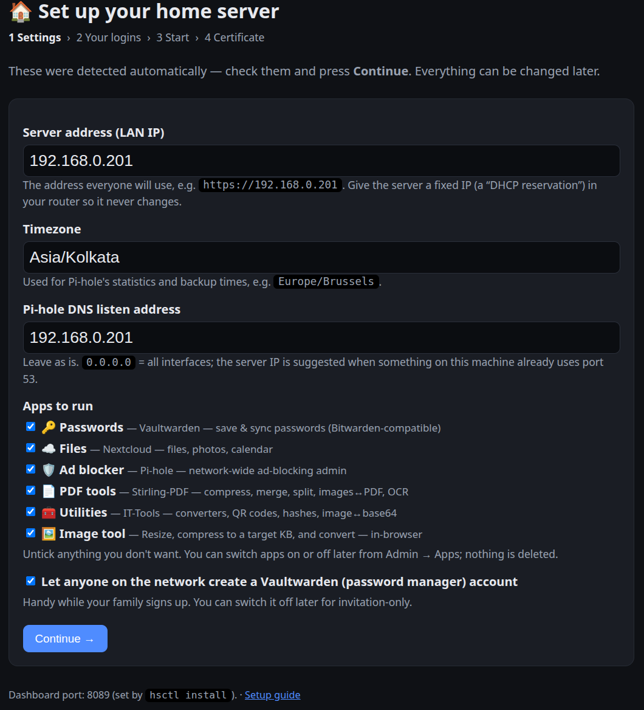 |
| **Your logins** — save the generated app credentials before starting | **Ready** — live startup progress, then install the certificate on each device |
| 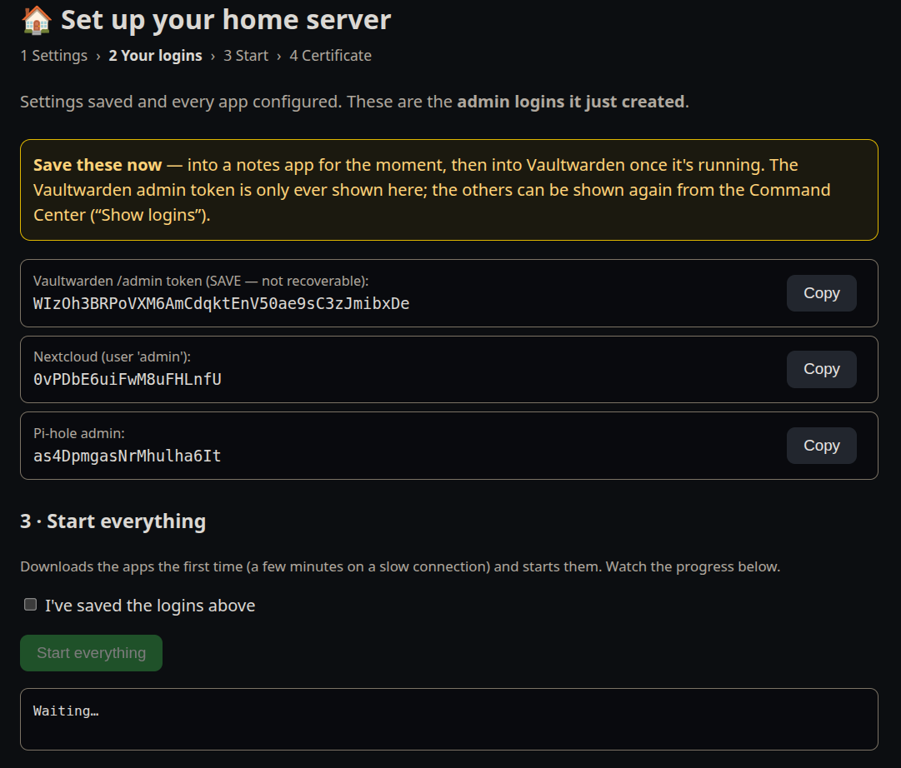 | 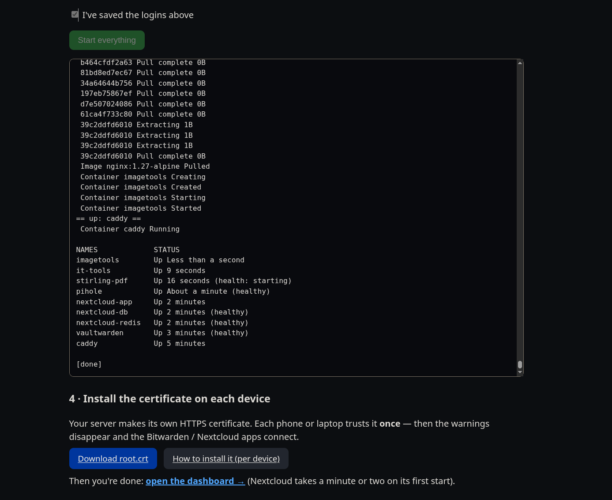 |
| **Admin** — CPU/RAM/disk, SMART health, backup freshness, container control | **Command Center** — every `hsctl` command as an explained card |
| 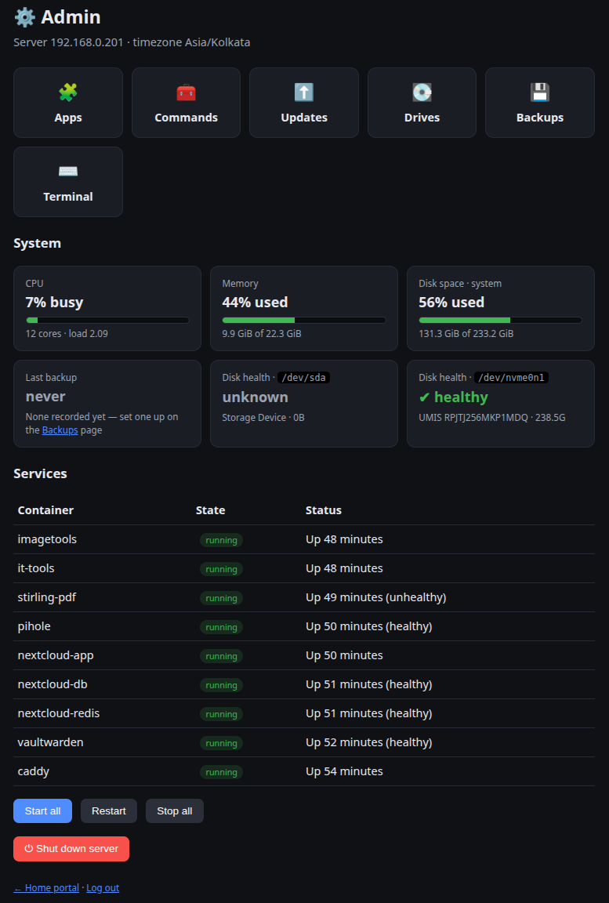 | 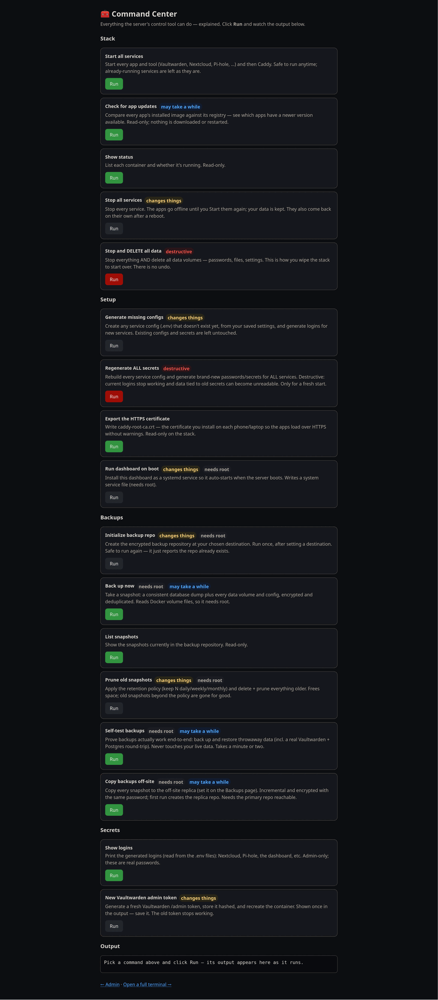 |
| **Apps** — switch any app on or off; its data is kept, so switching back on is instant | **Updates** — newer app versions at a glance, routine ones applied in one click |
| 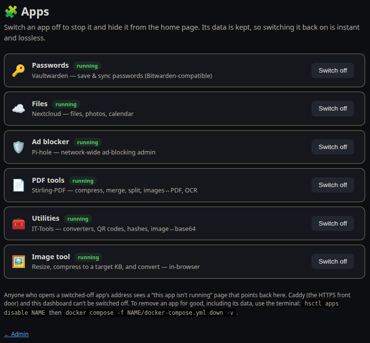 | 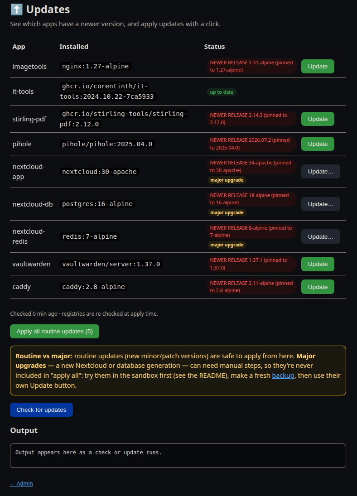 |
| **Backups** — destination, retention, off-site replica, snapshots | **Drives** — attached disks, one-click mount for backups |
| 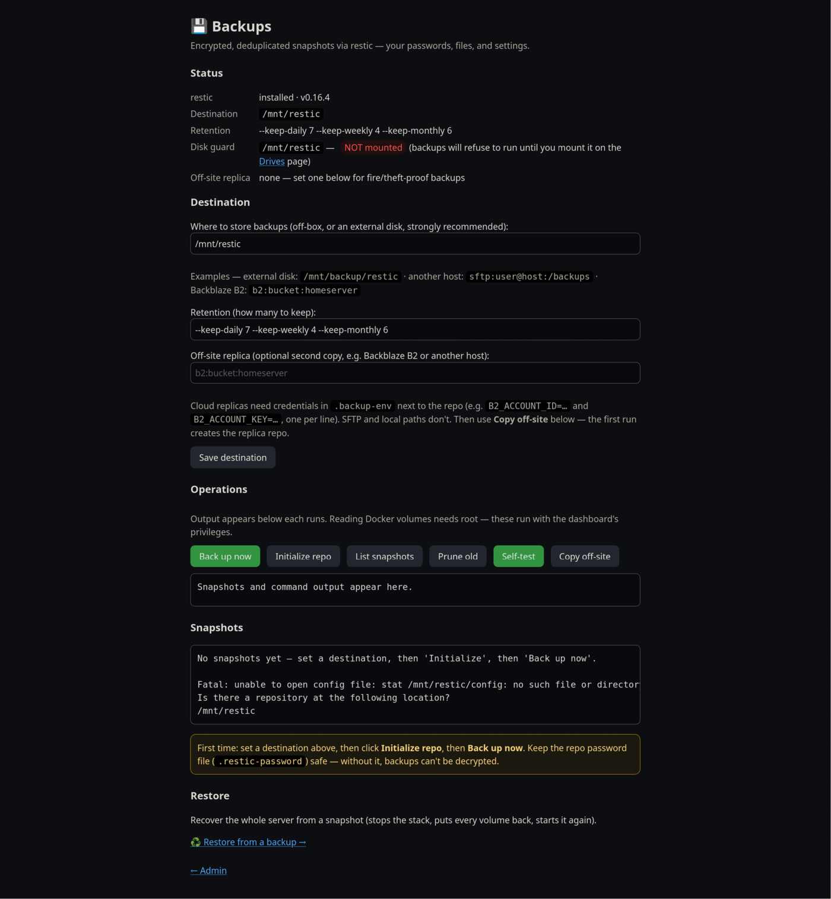 | 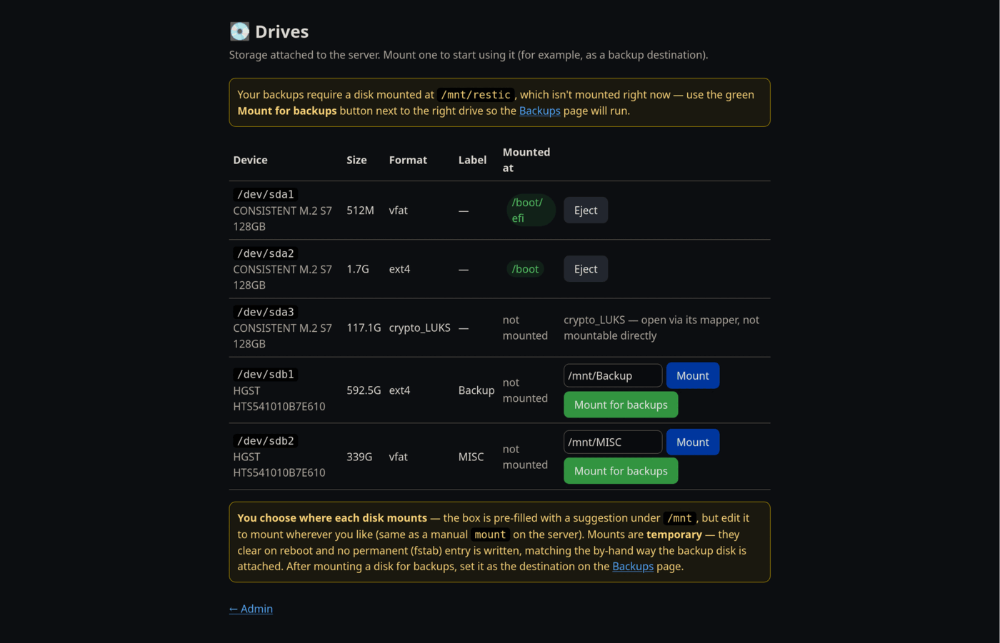 |
| **Terminal** — a real shell on the server, admin-gated | **Setup guide** — the onboarding page you hand to a new user |
| 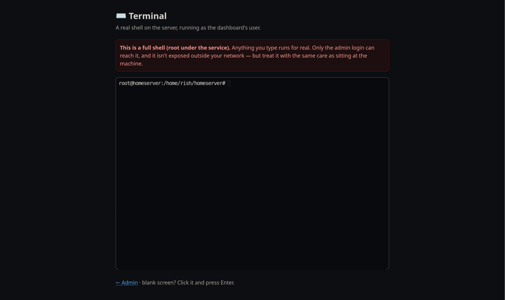 | 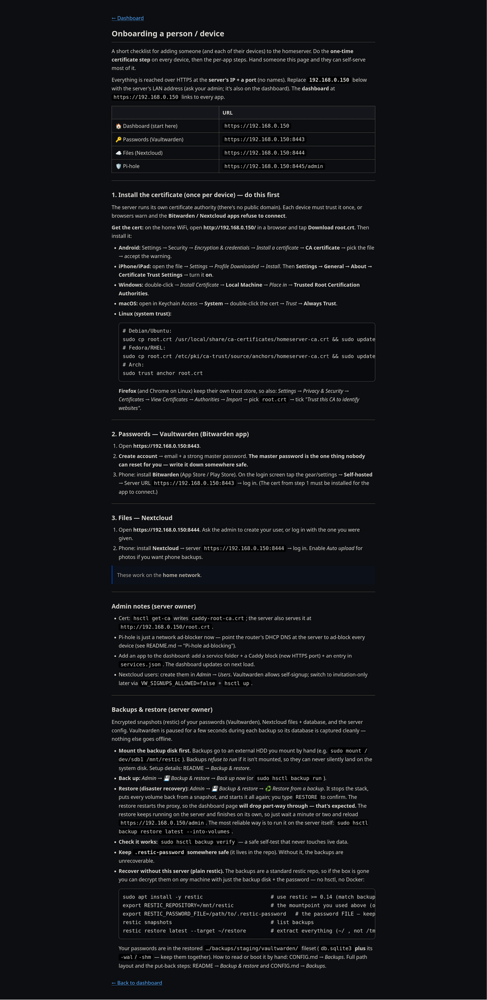 |

</details>

---

## Quick start

**You'll need:** a 64-bit Linux machine that stays on — x86-64 or arm64, so a mini-PC, a NUC
or a Raspberry Pi 4/5 on 64-bit Raspberry Pi OS (Ubuntu/Debian assumed) · a user with `sudo` ·
**Docker Engine + Compose v2** (`curl -fsSL https://get.docker.com | sh`) · a **fixed LAN IP**
for the server (a DHCP reservation in your router). Optional: `restic` for backups,
`docker-buildx-plugin` for `hsctl updates`, `smartmontools` for disk health.

```bash
# 1. Install hsctl + the stack (prebuilt binary, no Go toolchain needed)
curl -fsSL https://raw.githubusercontent.com/Rishikesh01/homeserver/main/install.sh | sh

# 2. Start the dashboard as a service — it prints the URL and your admin password
cd /opt/homeserver && sudo hsctl install
```

<details>
<summary>What the installer does — and building from source instead</summary>

<br>

It downloads the `hsctl` release binary for your architecture, checks it against the
release's `checksums.txt`, installs it to `/usr/local/bin`, and clones this repo at the
matching tag into `/opt/homeserver` (`hsctl` reads the compose files from there at runtime).
It starts nothing and writes no config. `VERSION=`, `HOMESERVER_DIR=` and `PREFIX=` override
the release, the checkout path and the install prefix.

To build it yourself instead — needs Go, see [`hsctl/go.mod`](hsctl/go.mod) for the version:

```bash
git clone https://github.com/Rishikesh01/homeserver.git && cd homeserver
make -C hsctl install     # version stamped from the git tag
```

</details>

`hsctl install` is the last thing you type. It brings up Caddy (the HTTPS front door)
and the dashboard, then tells you to open **`https://HOST/`** from any device on your
network. The first visit lands in a **setup wizard**: confirm the autodetected IP,
timezone, Pi-hole DNS address, and enabled apps; it generates every app's logins (shown
once — save them), then press **Start everything**. Startup progress remains available if
the browser briefly reconnects while images download, and the wizard finishes by walking
you through installing the certificate.

(Prefer a shell? `hsctl setup` → `hsctl up` does the same — see [docs/setup.md](docs/setup.md).)

Then, **once per device**: open `http://HOST/`, download `root.crt`, and trust it as a
certificate authority — otherwise browsers warn and the mobile apps refuse to connect. The
per-OS steps live in [ONBOARDING.md](ONBOARDING.md), which the dashboard also serves at
`https://HOST/help` so you can just send someone the link.

Full walkthrough: **[docs/setup.md](docs/setup.md)**.

---

## How it works

```
                    ┌─────────────────────────── your LAN ────────────────────────────┐
                    │                                                                 │
   phone / laptop ──┼──► :443  ┌───────┐                                              │
    (trusts the     │   :8443… │ Caddy │──► homeserver-edge (internal docker network) │
     private CA)    │          └───────┘        │                                     │
                    │              │            ├─ vaultwarden  ├─ stirling-pdf       │
                    │              │            ├─ nextcloud-app├─ it-tools           │
                    │              │            ├─ pihole       └─ imagetools         │
                    │              ▼                                                  │
                    │      host.docker.internal ──► hsctl ui  (host process, root)    │
                    └─────────────────────────────────────────────────────────────────┘
```

- **No app is published on the LAN.** Every service joins the external `homeserver-edge`
  Docker network and Caddy reaches it by container name, so Caddy's HTTPS is the only way in
  and nothing serves plaintext HTTP. The exceptions are deliberate: Pi-hole's `:53` (that's
  the point of Pi-hole) and port `:80`, which serves the CA certificate download only.
- **One HTTPS port per app** (`8443`–`8448`, dashboard on `443`), each with a `tls internal`
  certificate carrying the server's IP in its SAN.
- **The dashboard runs on the host, not in a container** — it manages Docker and offers a root
  shell, so `hsctl ui` binds only to loopback and the Docker bridge gateway, not the LAN
  (if the bridge can't be detected it warns and falls back to all interfaces). Caddy reaches
  it through `host.docker.internal`.
- **Start order** is fixed in [`hsctl/lifecycle.go`](hsctl/lifecycle.go): apps first, Caddy
  last; `hsctl down` reverses it.

More on the security posture: **[docs/security.md](docs/security.md)**.

---

## `hsctl`

```
hsctl setup                       Configure and generate each service's .env (interactive)
hsctl up | down | status          Start / stop / inspect the stack
hsctl updates                     Check whether newer app images are available (read-only)
hsctl get-ca                      Write caddy-root-ca.crt to install on devices
hsctl install                     Dashboard as a systemd service (+ first-install bootstrap → setup wizard)
hsctl ui                          Serve the web dashboard
hsctl secrets show                Print the generated logins (read from the .env files)
hsctl apps [enable|disable NAME]  List apps / switch one on or off (data kept; also Admin → Apps)
hsctl secrets rotate-vw-admin     Generate a new Vaultwarden /admin token
hsctl backup config | init | run  Configure / create / write to the encrypted repo
hsctl backup list | forget        List snapshots / apply retention and prune
hsctl backup verify               Self-test backup+restore on throwaway volumes
hsctl backup replicate            Copy every snapshot to the off-site replica
hsctl backup restore [snapshot]   Extract a snapshot (--into-volumes = one-command DR)
```

Every one of these is also a card in the dashboard's Command Center, with an explanation and a
Run button. Full reference: **[hsctl/README.md](hsctl/README.md)**.

---

## Backups

Encrypted, deduplicated [restic](https://restic.net) snapshots — the destination only ever
sees ciphertext. A snapshot holds a consistent Postgres dump, a consistent Vaultwarden SQLite
fileset, every data volume, and your config. Vaultwarden pauses for about a second so its
database is captured cleanly; nothing else goes offline.

```bash
hsctl backup config --repo /mnt/restic     # off the box: also sftp:, s3:
sudo hsctl backup init && sudo hsctl backup run
sudo hsctl backup verify                   # prove it restores — five checks, never touches live data
sudo hsctl backup restore latest --into-volumes    # one-command disaster recovery
```

`make -C hsctl install-services` adds a nightly timer. The repo is a **vanilla restic
repository**, so you can recover from any machine with the `restic` binary and the password —
no hsctl, no Docker, no this repo.

Details: **[docs/backup-restore.md](docs/backup-restore.md)**.

---

## Documentation

| Doc | What's in it |
|-----|--------------|
| [docs/setup.md](docs/setup.md) | Prerequisites, install, certificates, day-to-day, Pi-hole DNS |
| [docs/security.md](docs/security.md) | Threat model, hardening, where secrets live, rotating passwords |
| [docs/backup-restore.md](docs/backup-restore.md) | Backups, the verify drill, off-site replica, disaster recovery |
| [docs/configuration.md](docs/configuration.md) | Every configurable value, in one place |
| [docs/adding-an-app.md](docs/adding-an-app.md) | Add your own service to the stack and dashboard |
| [ONBOARDING.md](ONBOARDING.md) | The page you hand to a new person or device |
| [hsctl/README.md](hsctl/README.md) | `hsctl` command reference and the web admin pages |
| [sandbox/README.md](sandbox/README.md) | The throwaway test sandbox (try updates and restores safely) |

---

## Contributing

Contributions are welcome. The short version:

```bash
make -C hsctl build     # build
make -C hsctl vet       # go vet
make -C hsctl test      # go test ./...
make sandbox            # try changes in an isolated copy of the whole stack
```

See **[CONTRIBUTING.md](CONTRIBUTING.md)** for the details, and
[docs/adding-an-app.md](docs/adding-an-app.md) if you're adding a service.

## Security

This is designed for a **LAN only** — don't port-forward it. The threat model and hardening
checklist are in **[docs/security.md](docs/security.md)**.

## License

[MIT](LICENSE) © Rishikesh

The applications this stack runs (Vaultwarden, Nextcloud, Pi-hole, Stirling-PDF, IT-Tools,
Caddy) are separate projects under their own licenses.
